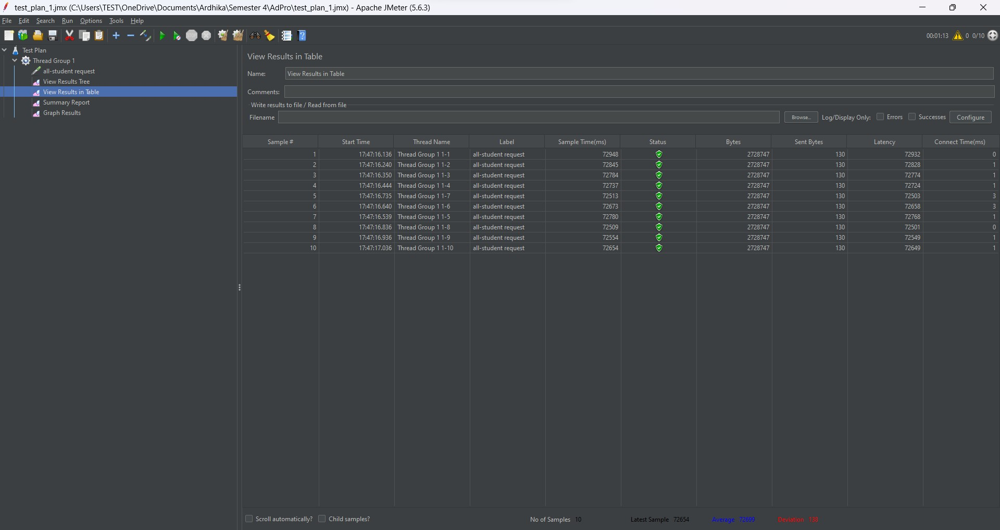
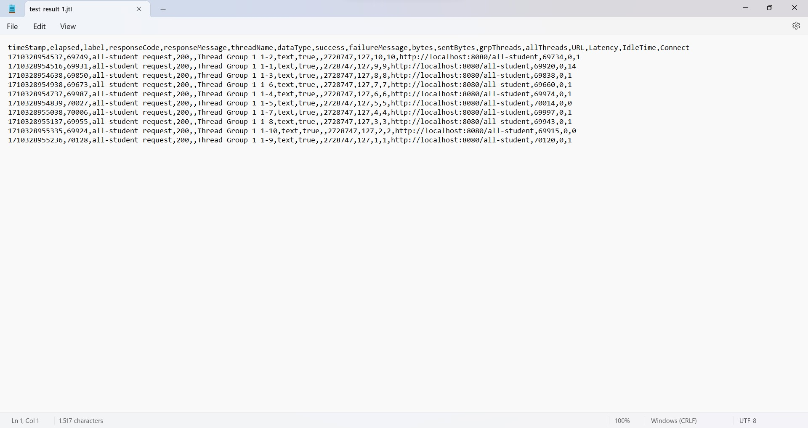
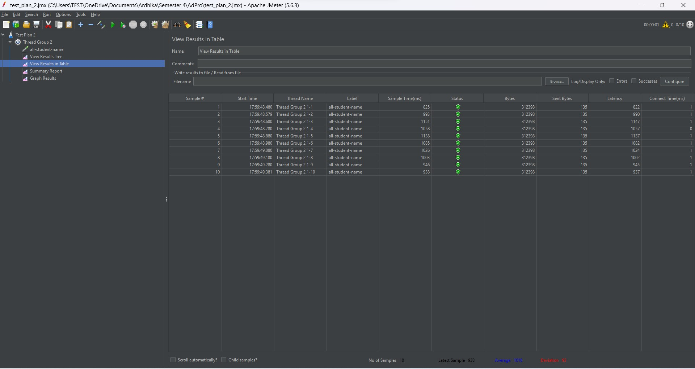
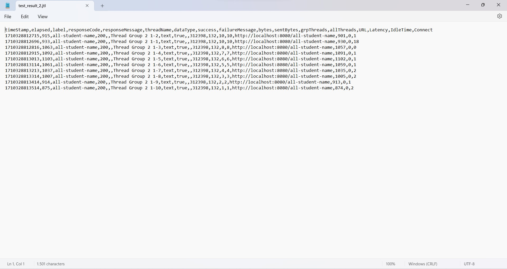
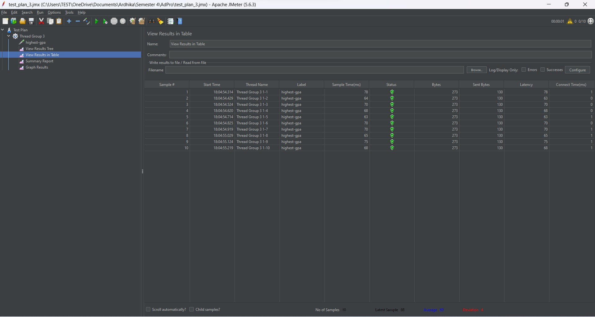
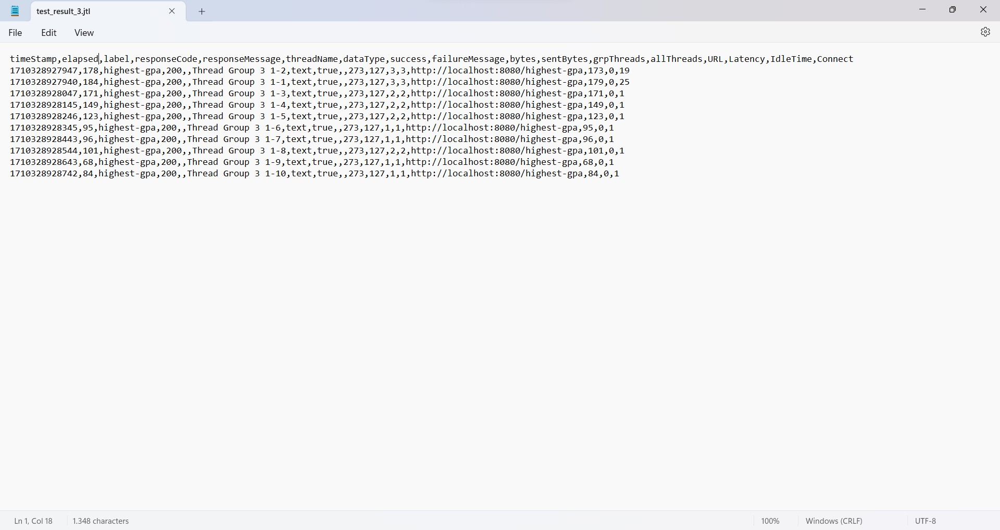
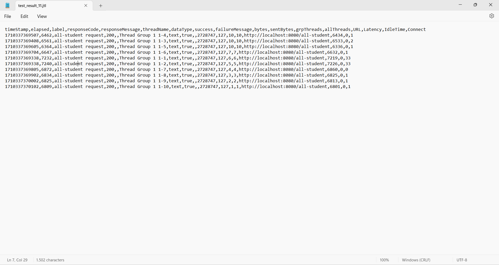
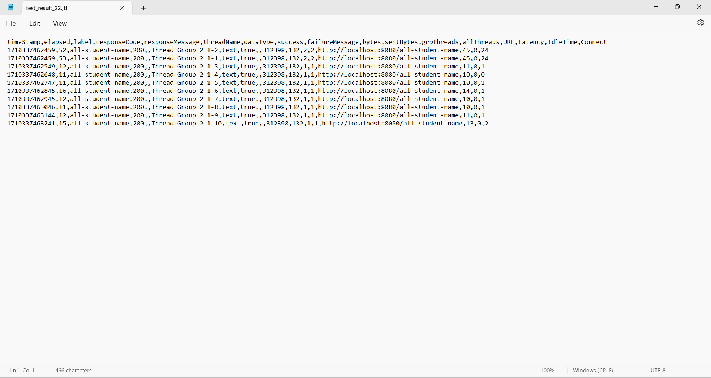
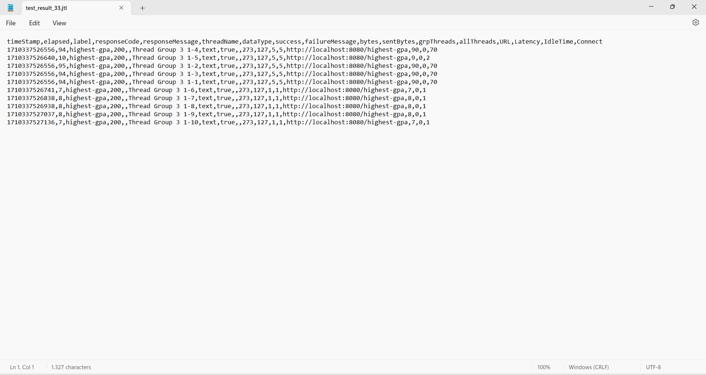

# 📝Tutorial & Exercise📝

**Student Details :**

|  `Attribute`  | `Information`              |
|---------------|----------------------------|
| Name          | Ardhika Satria Narendra    |
| Student ID    | 2206821866                 |
| Class         | Advanced Programming KKI   |

---
<details>
<summary>Module 05: Java Profiling 
Advanced Programming</summary>

### -> Screenshots
```/all-student```




```/all-student-name```




```highest-gpa```




### -> Optimization Results
```/all-student```


```/all-student-name```


```highest-gpa```


## Questions and Answers

### -> Reflection 

1. What is the difference between the approach of performance testing with Jmeter profiling with intelliJ profiler in the context of optimizing application performance? 
    JMeter is best for understanding how an application performs under pressure or high load, and it's useful for mirroring actual events and traffic situations. It helps the external identification of performance limitations relating to scalability. With IntelliJ Profiler, users can look into the inner workings of the application code in more detail. It demonstrates how quickly and effectively the code uses memory. It detects which code parts need improvement. By simply merging JMeter and IntelliJ Profiler provides an effective approach for improving the performance of applications. Where the issues happen during load can be found with JMeter, and at the code and resource use level, IntelliJ Profiler explains why those issues appear.

2. How does the profiling process help you in identifying and understanding the weak points in your application?
   Profiling closely monitors the application's performance in real time, allowing users to focus on the problem area. It's like having a health check-up for your app, where you get to see which parts are not working as they should.

3. Do you think IntelliJ Profiler is effective in assisting you to analyze and identify bottlenecks in your application code?
   Yes, I feel that  IntelliJ Profiler is a useful tool for analyzing and finding bottlenecks in application code. It helps identify and quickly solve specific issues by giving clear insights into resource utilization and performance issues directly within the development environment.

4. What are the main challenges you face when conducting performance testing and profiling, and how do you overcome these challenges?
   The biggest difficulties I faced while testing and analyzing Intellij profiling functionality is correctly interpreting data. It’s very overwhelming to deal with the vast amount of data generated. To figure out how to solve this, I used visualization tools and focused on key performance indicators. I also talked about this with my private mentor.

5. What are the main benefits you gain from using IntelliJ Profiler for profiling your application code?
   The biggest benefit I got from using IntelliJ Profiler is a deep understanding of code execution problems. It easily integrates with my development environment, allowing me to identify and solve memory leaks and other issues straight to my codes. Without having to modify contexts or tools, this quick response process allows me to make adjustments on the spot, easily improving the productivity and dependability of my programmes.

6. How do you handle situations where the results from profiling with IntelliJ Profiler are not entirely consistent with findings from performance testing using JMeter?
   When IntelliJ Profiler and JMeter show different results, I double-check their settings to make sure they match situations that are actual. I remember IntelliJ focused on specific code parts, while JMeter evaluates the overall performance of the project. By comparing and adjusting both tests, I discover and fix the issues that caused that difference, making my optimisation plans more complete.

7. What strategies do you implement in optimizing application code after analyzing results from performance testing and profiling? How do you ensure the changes you make do not affect the application's functionality?
   After reviewing profiling and performance testing, I focused on improving the slow parts of the code without affecting what it does. I deploy automated tests to make sure that the software keeps running as planned. This allows me to securely speed up the programme without harming its functionality.

</details>

---